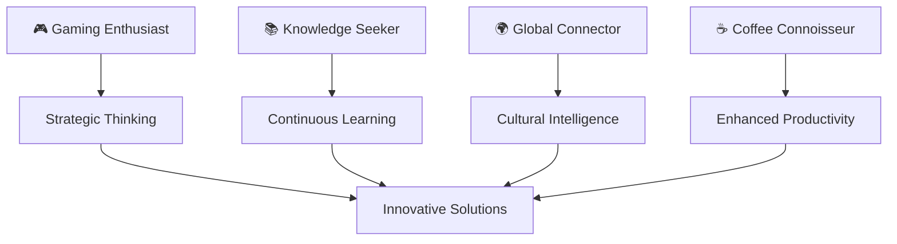

<div align="center">

# 🌟 THARIDUL.EXE 🌟
### `Digital Architect • Code Wizard • Innovation Catalyst`


<div style="background: linear-gradient(135deg, #667eea 0%, #764ba2 100%); padding: 20px; border-radius: 15px; margin: 20px 0;">

[](https://git.io/typing-svg)

</div>

---

## 🔮 **NEURAL NETWORK STATUS**

<table align="center">
<tr>
<td align="center" width="50%">

```ascii
╔══════════════════════════════╗
║  🧠 COGNITIVE ARCHITECTURE  ║
╠══════════════════════════════╣
║  ▰▰▰▰▰▰▰▰▰▱ 90% CREATIVITY  ║
║  ▰▰▰▰▰▰▰▰▱▱ 80% LOGIC       ║
║  ▰▰▰▰▰▰▰▰▰▰ 100% PASSION    ║
║  ▰▰▰▰▰▰▰▰▱▱ 85% COFFEE      ║
╚══════════════════════════════╝
```

</td>
<td align="center" width="50%">

```ascii
╔═══════════════════════════════╗
║    🎯 CURRENT OBJECTIVES      ║
╠═══════════════════════════════╣
║  → Revolutionizing Web3 UX    ║
║  → Building AI-Powered Tools  ║
║  → Mastering Quantum Computing║
║  → Creating Digital Magic ✨  ║
╚═══════════════════════════════╝
```

</td>
</tr>
</table>

---

## 🚀 **QUANTUM SKILL MATRIX**

<div align="center">

| 🌐 **FRONTEND MASTERY** | 🔧 **BACKEND ARSENAL** | 🛠️ **DEVOPS TOOLKIT** |
|:---:|:---:|:---:|
|  |  |  |
|  |  |  |
|  |  |  |
|  |  |  |

</div>

---

## 📊 **DIGITAL FOOTPRINT ANALYTICS**

<div align="center">


</div>

---

## 🌌 **QUANTUM SOCIAL NETWORK**

<div align="center">

[](https://www.linkedin.com/in/tharidul/)
[](https://www.youtube.com/@tharindulakmal5593)
[](https://www.hackerrank.com/profile/tharindulakmal51)

</div>

---

## 🎭 **PERSONALITY MATRIX**

<div align="center">



</div>

---

## 🚀 **COLLABORATION PROTOCOLS**

<div align="center">

### 🌟 Ready to Build the Future Together? 🌟

<table>
<tr>
<td align="center">

```python
class Collaboration:
    def __init__(self):
        self.status = "ACTIVE"
        self.enthusiasm = float('inf')
        self.coffee_level = "MAXIMUM"
    
    def lets_build_something_amazing(self):
        return "🚀 LAUNCH SEQUENCE INITIATED!"
```

</td>
</tr>
</table>

**Seeking:** Visionary partners for revolutionary projects  
**Specialty:** Turning impossible ideas into reality  
**Mission:** Code the future, one commit at a time  

</div>

---

<div align="center">

### 🌈 `Thank you for visiting my digital realm!` 🌈


</div>

</div>
